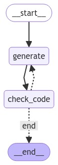

# README

This repository implements an LLM agent that receives a user's prompt and corresponding unit tests. The agent generates the code, tests it for correct execution, and ensures it passes the unit tests. If the code fails to execute or fails any unit test, the agent regenerates the code until it succeeds.




This project builds upon the code from LangChain's Notebook (https://github.com/mistralai/cookbook/blob/main/third_party/langchain/langgraph_code_assistant_mistral.ipynb), where an agent generates code based on the user's prompt and checks if the execution works.

The main contribution of this project is the integration of unit tests into the code execution process.

Additionally, the original Jupyter notebook code has been refactored into a structured Python project suitable for deployment. By adhering to best coding practices, the code has been modularized, reusable functions have been created, and proper documentation and testing have been ensured. The result is a well-organized .py project that is maintainable and ready for production.


## Setup Instructions

1. Clone the repository:


```python
git clone https://github.com/paulomuraroferreira/Self_correcting_coding_agent.git
cd Self_correcting_coding_agent
```

2. Install Dependencies:

```python
$pip install -e .
```

3. Environment Configuration:

Create a .env file and fill the following environment variables:

```python
OPENAI_API_KEY=your_openai_api_key
OPENAI_CHAT_MODEL="gpt-4o-2024-08-06"
```

4. Run the Application:

Input the code's prompt in the main.py file. The prompt should be descriptive and specify the name of the classes.

For example:

    QUESTION3 = '''
    Python Class Description
    Class Name: BankAccount

    Description:
    The BankAccount class represents a user's bank account, allowing for deposits, withdrawals, and viewing the transaction history. The class ensures that withdrawals cannot exceed the current balance and that deposits and withdrawals are properly recorded in the transaction history.

    Attributes:

    balance (float): The current balance of the account, initialized to 0.
    transactions (list): A list to store the history of transactions. Each transaction is stored as a dictionary with keys type (either 'deposit' or 'withdrawal'), amount, and date.
    Methods:

    deposit(amount: float) -> None: Adds the specified amount to the balance and records the transaction.
    withdraw(amount: float) -> bool: Attempts to subtract the specified amount from the balance. Returns True if successful, otherwise returns False. Records the transaction if successful.
    get_balance() -> float: Returns the current balance.
    get_transaction_history() -> list: Returns a list of all transactions.
    '''

    main = Main(QUESTION3)

5. Add the unit test code in a .py file in the the src/unit_test_folder. Also, import the corresponding class from the 
code_solution.py file. For example, for the above prompt, the LLM will generate a class called BankAccount. Therefore, the 
src/unit_test_folder/test_unit_test.py should include:

    from src.code_solution import BankAccount

6. Run the main.py file. 

    ```python
    python main.py
    ```


## Example 

For the example above, the code will display the following output:

    ================================ Human Message =================================


    Python Class Description
    Class Name: BankAccount

    Description:
    The BankAccount class represents a user's bank account, allowing for deposits, withdrawals, and viewing the transaction history. The class ensures that withdrawals cannot exceed the current balance and that deposits and withdrawals are properly recorded in the transaction history.

    Attributes:

    balance (float): The current balance of the account, initialized to 0.
    transactions (list): A list to store the history of transactions. Each transaction is stored as a dictionary with keys type (either 'deposit' or 'withdrawal'), amount, and date.
    Methods:

    deposit(amount: float) -> None: Adds the specified amount to the balance and records the transaction.
    withdraw(amount: float) -> bool: Attempts to subtract the specified amount from the balance. Returns True if successful, otherwise returns False. Records the transaction if successful.
    get_balance() -> float: Returns the current balance.
    get_transaction_history() -> list: Returns a list of all transactions.

    2024-08-18 14:51:24,955 - INFO - agent.py - ---GENERATING CODE SOLUTION---
    ================================== Ai Message ==================================

    Here is my attempt to solve the problem: The BankAccount class is designed to manage a user's bank account by allowing deposits, withdrawals, and tracking transaction history. It ensures that withdrawals do not exceed the available balance and records each transaction with details such as type, amount, and date. 
    Imports: from datetime import datetime 
    Code: class BankAccount:
        def __init__(self):
            self.balance = 0.0
            self.transactions = []

        def deposit(self, amount: float) -> None:
            self.balance += amount
            transaction = {
                'type': 'deposit',
                'amount': amount,
                'date': datetime.now()
            }
            self.transactions.append(transaction)

        def withdraw(self, amount: float) -> bool:
            if amount > self.balance:
                return False
            self.balance -= amount
            transaction = {
                'type': 'withdrawal',
                'amount': amount,
                'date': datetime.now()
            }
            self.transactions.append(transaction)
            return True

        def get_balance(self) -> float:
            return self.balance

        def get_transaction_history(self) -> list:
            return self.transactions
    2024-08-18 14:51:28,979 - INFO - agent.py - ---CHECKING CODE---
    2024-08-18 14:51:29,170 - INFO - agent.py - 
    ============================= test session starts ==============================
    platform linux -- Python 3.12.3, pytest-8.3.2, pluggy-1.5.0 -- /home/paulo/Python_projects/Self_correcting_coding_agent/venv/bin/python
    cachedir: .pytest_cache
    rootdir: /home/paulo/Python_projects/Self_correcting_coding_agent
    configfile: pyproject.toml
    plugins: anyio-4.4.0
    collecting ... collected 7 items

    src/unit_test_folder/test_unit_test.py::test_initial_balance PASSED      [ 14%]
    src/unit_test_folder/test_unit_test.py::test_deposit PASSED              [ 28%]
    src/unit_test_folder/test_unit_test.py::test_withdrawal_successful PASSED [ 42%]
    src/unit_test_folder/test_unit_test.py::test_withdrawal_insufficient_funds PASSED [ 57%]
    src/unit_test_folder/test_unit_test.py::test_transaction_history PASSED  [ 71%]
    src/unit_test_folder/test_unit_test.py::test_invalid_deposit FAILED      [ 85%]
    src/unit_test_folder/test_unit_test.py::test_invalid_withdrawal FAILED   [100%]

    =================================== FAILURES ===================================
    _____________________________ test_invalid_deposit _____________________________

    account = <src.code_solution.BankAccount object at 0x7fac0d4f0b90>

        def test_invalid_deposit(account):
            """Test that depositing a negative amount raises ValueError."""
    >       with pytest.raises(ValueError):
    E       Failed: DID NOT RAISE <class 'ValueError'>

    src/unit_test_folder/test_unit_test.py:48: Failed
    ___________________________ test_invalid_withdrawal ____________________________

    account = <src.code_solution.BankAccount object at 0x7fac0d4f1f40>

        def test_invalid_withdrawal(account):
            """Test that withdrawing a negative amount raises ValueError."""
    >       with pytest.raises(ValueError):
    E       Failed: DID NOT RAISE <class 'ValueError'>

    src/unit_test_folder/test_unit_test.py:53: Failed
    =========================== short test summary info ============================
    FAILED src/unit_test_folder/test_unit_test.py::test_invalid_deposit - Failed:...
    FAILED src/unit_test_folder/test_unit_test.py::test_invalid_withdrawal - Fail...
    ========================= 2 failed, 5 passed in 0.02s ==========================

    2024-08-18 14:51:29,170 - INFO - agent.py - Some tests failed.
    2024-08-18 14:51:29,172 - INFO - agent.py - ---DECISION: RE-TRY SOLUTION---
    ================================ Human Message =================================

    Your solution failed the unit test: ============================= test session starts ==============================
    platform linux -- Python 3.12.3, pytest-8.3.2, pluggy-1.5.0 -- /home/paulo/Python_projects/Self_correcting_coding_agent/venv/bin/python
    cachedir: .pytest_cache
    rootdir: /home/paulo/Python_projects/Self_correcting_coding_agent
    configfile: pyproject.toml
    plugins: anyio-4.4.0
    collecting ... collected 7 items

    src/unit_test_folder/test_unit_test.py::test_initial_balance PASSED      [ 14%]
    src/unit_test_folder/test_unit_test.py::test_deposit PASSED              [ 28%]
    src/unit_test_folder/test_unit_test.py::test_withdrawal_successful PASSED [ 42%]
    src/unit_test_folder/test_unit_test.py::test_withdrawal_insufficient_funds PASSED [ 57%]
    src/unit_test_folder/test_unit_test.py::test_transaction_history PASSED  [ 71%]
    src/unit_test_folder/test_unit_test.py::test_invalid_deposit FAILED      [ 85%]
    src/unit_test_folder/test_unit_test.py::test_invalid_withdrawal FAILED   [100%]

    =================================== FAILURES ===================================
    _____________________________ test_invalid_deposit _____________________________

    account = <src.code_solution.BankAccount object at 0x7fac0d4f0b90>

        def test_invalid_deposit(account):
            """Test that depositing a negative amount raises ValueError."""
    >       with pytest.raises(ValueError):
    E       Failed: DID NOT RAISE <c ... (truncated)
    2024-08-18 14:51:29,175 - INFO - agent.py - ---GENERATING CODE SOLUTION---
    ================================== Ai Message ==================================

    Here is my attempt to solve the problem: The previous solution did not handle cases where negative amounts were deposited or withdrawn. The unit tests expect a ValueError to be raised in such cases, but the original implementation did not include this validation. To fix this, we need to add checks in the deposit and withdraw methods to raise a ValueError if the amount is negative. 
    Imports: from datetime import datetime 
    Code: class BankAccount:
        def __init__(self):
            self.balance = 0.0
            self.transactions = []

        def deposit(self, amount: float) -> None:
            if amount < 0:
                raise ValueError("Deposit amount must be positive.")
            self.balance += amount
            transaction = {
                'type': 'deposit',
                'amount': amount,
                'date': datetime.now()
            }
            self.transactions.append(transaction)

        def withdraw(self, amount: float) -> bool:
            if amount < 0:
                raise ValueError("Withdrawal amount must be positive.")
            if amount > self.balance:
                return False
            self.balance -= amount
            transaction = {
                'type': 'withdrawal',
                'amount': amount,
                'date': datetime.now()
            }
            self.transactions.append(transaction)
            return True

        def get_balance(self) -> float:
            return self.balance

        def get_transaction_history(self) -> ... (truncated)
    2024-08-18 14:51:34,913 - INFO - agent.py - ---CHECKING CODE---
    2024-08-18 14:51:35,131 - INFO - agent.py - 
    ============================= test session starts ==============================
    platform linux -- Python 3.12.3, pytest-8.3.2, pluggy-1.5.0 -- /home/paulo/Python_projects/Self_correcting_coding_agent/venv/bin/python
    cachedir: .pytest_cache
    rootdir: /home/paulo/Python_projects/Self_correcting_coding_agent
    configfile: pyproject.toml
    plugins: anyio-4.4.0
    collecting ... collected 7 items

    src/unit_test_folder/test_unit_test.py::test_initial_balance PASSED      [ 14%]
    src/unit_test_folder/test_unit_test.py::test_deposit PASSED              [ 28%]
    src/unit_test_folder/test_unit_test.py::test_withdrawal_successful PASSED [ 42%]
    src/unit_test_folder/test_unit_test.py::test_withdrawal_insufficient_funds PASSED [ 57%]
    src/unit_test_folder/test_unit_test.py::test_transaction_history PASSED  [ 71%]
    src/unit_test_folder/test_unit_test.py::test_invalid_deposit PASSED      [ 85%]
    src/unit_test_folder/test_unit_test.py::test_invalid_withdrawal PASSED   [100%]

    ============================== 7 passed in 0.01s ===============================

    2024-08-18 14:51:35,131 - INFO - agent.py - All tests passed!
    2024-08-18 14:51:35,131 - INFO - agent.py - ---NO CODE TEST FAILURES---
    2024-08-18 14:51:35,133 - INFO - agent.py - ---DECISION: FINISH---